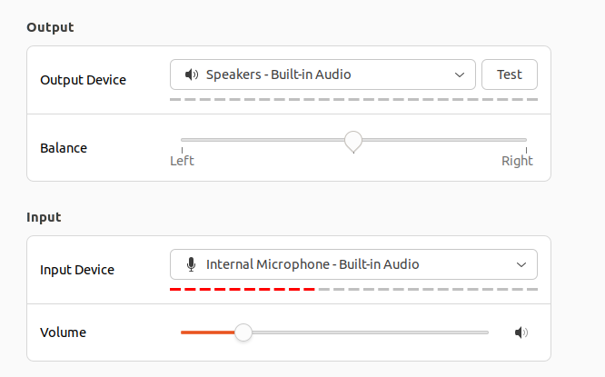

<div align="center">
    <h1>
    Robots as Furniture
    </h1>
    <p>
    <b>Robots as Furniture</b> is a Python project that enables robots to function as responsive, voice-controlled furniture by interpreting spoken commands through multi-microphone audio processing and OpenAI's AI models, and executing movements via sound source localization and ROS2. <br>
    </p>
    <p>
    
    </p>
    <p>
    </p>
    <a href="https://github.com/robotsasfurniture/passive-sound-localization"></a>
</div>

# Table of Contents

1. [Installation](#installation)
2. [Running the project](#running-the-project)
3. [Acknowledgements](#acknowledgments)
4. [Citation](#citation)

# Installation

As a pre-requisite, you must have [Poetry](https://python-poetry.org/) installed.

In addition, the project uses the [OpenAI API](https://platform.openai.com/docs/overview). In order to use the OpenAI API, you must sign up with OpenAI and get an API key. The API key should be stored securely in an environment variable, such as an `.env` file:

```bash
OPENAI_API_KEY="your_api_key_here"
```

To install the project, clone the git repo by running the following commands in your terminal:

```bash
git clone https://github.com/robotsasfurniture/passive-sound-localization.git
cd passive-sound-localization
```

# Running in Docker

To run the project in Docker, run this bash command in your terminal:

```bash
poetry run docker
```

# Building Project on Lab Laptop
To build the project on the lab laptop, first make sure that you're in the correct directory:

```bash
cd ros2_ws/src
```

Then make sure to start a virtual environment using the following bash command in your terminal:

```bash
source ../venv/bin/activate
```

Finally, to build the project, run the following bash command:

```bash
source /opt/ros/iron/setup.bash && colcon build
```

# Running Project on Lab Laptop
To run the project on the lab laptop, make sure that the project has been built before running the project. Refer to the [Building Project on Lab Laptop](#building-project-on-lab-laptop) section, before running the project.

To run the project on the lab laptop, the `passive_sound_localization` and the `movement_library` must be run on **separate** terminals.

## Running Passive Sound Localization ROS package
To run the `passive_sound_localization` ROS package on the lab laptop, run the following bash command in your terminal:

```bash
source install/setup.bash && ros2 launch passive_sound_localization localization_launch.py
```

## Running Movement Library ROS package
To run the `movement_library` ROS package on the lab laptop, run the following bash command in your terminal:

```bash
source install/setup.bash && ros2 launch movement_library movement_launch.py
```


# Running Tests

To run the project's automated tests, run this bash command in your terminal:

```bash
poetry run pytest
```

# Debugging Issues on Lab Laptop
## Microphone Device Indexing
This project identifies microphones by their device index to configure the audio input for sound localization accurately. During runtime, if an "Invalid number of channels" error appears, it's likely due to device indices shifting, which can happen when audio settings change. To prevent index shifting, ensure that in **Settings > Sound > Output**, the Output Device is set to "Speakers - Built-in Audio", and in **Settings > Sound > Input**, the Input Device is "Internal Microphone - Built-in Audio".



Optionally, you can run the `check_device_indices` script to check what the current device indices are for the machine. To run `check_device_indices`, following command in a bash terminal:
```bash
poetry run python packages/passive_sound_localization/passive_sound_localization/check_device_indices.py
```


## Microphone Volume Settings
To ensure optimal performance and accurate sound localization, set each microphone’s volume to maximum in the system’s audio settings. This helps the microphones pick up voices clearly, even at a distance, improving the project's ability to detect and respond to people speaking. Low microphone volume can lead to inaccurate sound localization or missed voice detections. Check each microphone in **Settings > Sound > Input > Volume** to confirm the input volume is set to the highest level before starting the project.


# Acknowledgements

We thank the contributors to take the time and energy to contribute to this repo.

# Citation

If you'd like to cite this project, please use this BibTex:

```
@article{perez2024robotsasfurniture,
  title={Robots as Furniture},
  author={Nicolas Perez, John Finberg, Dave Song and others},
  journal={https://example.com/},
  year={2024}
}
```
